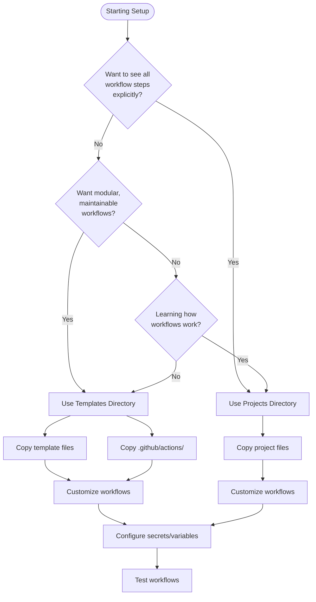

# GitHub Actions Template - Setup Guide

> **Complete guide for setting up CI/CD workflows in your repository using this template**

This guide will walk you through everything you need to know to set up and use this GitHub Actions template repository. By the end, you'll be able to configure CI/CD workflows for your project without additional guidance.

## Table of Contents

1. [Quick Start](#quick-start)
2. [Understanding the Repository](#understanding-the-repository)
3. [Choosing Your Approach](#choosing-your-approach)
4. [Setup Steps](#setup-steps)
5. [Configuration](#configuration)
6. [Testing Your Setup](#testing-your-setup)
7. [Troubleshooting](#troubleshooting)

---

## Quick Start

**Fastest path to a working setup:**

1. **Identify your project type:**
   - Backend (Kotlin/Java, Python, or Go)
   - Frontend (React, Vue, Angular, etc.)
   - Infrastructure (Terraform)

2. **Choose your approach:**
   - **Templates** (recommended): Modular workflows using composite actions
   - **Projects**: Fully expanded workflows for reference/learning

3. **Copy the appropriate files:**
   ```bash
   # For backend Kotlin with ECS deployment
   cp templates/backend/kotlin/pr-check.yml your-project/.github/workflows/
   cp templates/backend/kotlin/ecs/deploy-*.yml your-project/.github/workflows/
   ```

4. **Copy composite actions:**
   ```bash
   cp -r .github/actions your-project/.github/
   ```

5. **Configure secrets and variables** (see [Configuration](#configuration))

6. **Customize workflows** (update TODO comments)

7. **Test** (create a PR or push to main)

For detailed instructions, continue reading below.

---

## Understanding the Repository

This repository provides two ways to set up CI/CD workflows:

### Templates (`templates/` directory)

**What they are:**
- Reusable workflow files that use composite actions
- Modular and maintainable
- Reference composite actions from `.github/actions/`

**When to use:**
- You want clean, maintainable workflows
- You prefer modular architecture
- You want to update workflows centrally (by updating composite actions)

**Structure:**
```
templates/
├── backend/
│   ├── kotlin/
│   │   ├── pr-check.yml
│   │   ├── eks/
│   │   └── ecs/
│   └── python/
├── frontend/
│   ├── cloudfront/
│   └── amplify/
├── infra/
└── best-practices/
```

### Sample Projects (`projects/` directory)

**What they are:**
- Complete example projects with fully expanded workflows
- All steps written out explicitly (no composite action references)
- Ready-to-test codebases

**When to use:**
- You want to see all steps explicitly
- You prefer self-contained workflows
- You're learning how workflows work
- You want to modify workflows without understanding composite actions

**Structure:**
```
projects/
├── backend-kotlin/
├── backend-python/
├── backend-go/
├── frontend/
└── infra/
```

### Composite Actions (`.github/actions/` directory)

**What they are:**
- Reusable workflow steps packaged as actions
- Used by templates for modularity
- Can be used directly in your workflows

**Key composite actions:**
- `setup-environment` - GitHub auth + AWS + language setup
- `build-and-package` - Build code + Docker operations
- `deploy-and-notify` - Deploy + notifications
- `build-and-test` - Setup + build + lint + test

**Location:** Must be copied to your repository at `.github/actions/`

---

## Choosing Your Approach

Use this decision tree to choose between Templates and Projects:



### Comparison Table

| Aspect | Templates | Projects |
|--------|-----------|----------|
| **Workflow Style** | Uses composite actions | All steps expanded |
| **Maintainability** | High (update actions centrally) | Medium (update each workflow) |
| **Readability** | Clean, concise | Detailed, explicit |
| **Learning Curve** | Requires understanding composite actions | Easier to understand |
| **Best For** | Production use, multiple projects | Learning, single project |
| **Dependencies** | Requires `.github/actions/` | Self-contained |

### Recommendation

- **Use Templates** if you're setting up CI/CD for production use
- **Use Projects** if you're learning or want to see all steps explicitly

You can also use Projects as a reference to understand how Templates work internally.

---

## Setup Steps

### Step 1: Choose Your Templates or Projects

Based on your project type and deployment target:

#### For Backend Projects

**Kotlin/Java:**
```bash
# Templates approach
cp templates/backend/kotlin/pr-check.yml your-project/.github/workflows/
cp templates/backend/kotlin/eks/deploy-*.yml your-project/.github/workflows/  # For EKS
# OR
cp templates/backend/kotlin/ecs/deploy-*.yml your-project/.github/workflows/  # For ECS
```

**Python:**
```bash
# Templates approach
cp templates/backend/python/pr-check.yml your-project/.github/workflows/
cp templates/backend/python/eks/deploy-*.yml your-project/.github/workflows/  # For EKS
# OR
cp templates/backend/python/ecs/deploy-*.yml your-project/.github/workflows/  # For ECS
```

#### For Frontend Projects

**CloudFront/S3:**
```bash
cp templates/frontend/cloudfront/pr-check.yml your-project/.github/workflows/
cp templates/frontend/cloudfront/deploy-*.yml your-project/.github/workflows/
```

**Amplify:**
```bash
cp templates/frontend/amplify/pr-check.yml your-project/.github/workflows/
cp templates/frontend/amplify/deploy-*.yml your-project/.github/workflows/
```

#### For Infrastructure (Terraform)

```bash
cp templates/infra/pr-check.yml your-project/.github/workflows/
cp templates/infra/deploy-*.yml your-project/.github/workflows/
```

### Step 2: Copy Composite Actions (Templates Only)

If you're using templates, you need to copy the composite actions:

```bash
# Create .github directory if it doesn't exist
mkdir -p your-project/.github

# Copy all composite actions
cp -r .github/actions your-project/.github/
```

**Important:** Composite actions must be in your repository at `.github/actions/` for templates to work.

### Step 3: Customize Workflows

Open each workflow file and look for `TODO:` comments. Update:

#### Frontend Customization

- **Node.js version**: Update `NODE_VERSION` (e.g., `18.18.2`)
- **Environment variables**: Add `VITE_*` variables in `env:` section
- **Package manager**: Update if not using `yarn`
- **Build command**: Update if different from default

#### Backend Customization

**For Kotlin/Java:**
- **Java version**: Update `JAVA_VERSION` (usually `17`)
- **Gradle build commands**: Update if project structure differs
- **Docker paths**: Update `docker_context` and `dockerfile` paths
- **Service name**: Update `SERVICE_NAME` variable

**For Python:**
- **Python version**: Update `PYTHON_VERSION` (usually `3.11`)
- **Dependencies**: Configure pip or Poetry steps
- **Docker paths**: Update `docker_context` and `dockerfile` paths
- **Service name**: Update `SERVICE_NAME` variable

**For All Backend:**
- **Helm config**: Update `HELM_REPO`, `HELM_SPARTAN_VERSION` (for EKS)
- **ECS config**: Update `ECS_CLUSTER_NAME_*`, `TASK_FAMILY_*`, `CONTAINER_NAME` (for ECS)

#### Infrastructure Customization

- **Terraform version**: Update `TF_VERSION` if specified
- **Working directory**: Update if Terraform files are in a subdirectory
- **Backend configuration**: Set up `TF_BACKEND_CONFIG_*` secrets if needed

### Step 4: Configure GitHub Secrets and Variables

Go to your repository → **Settings** → **Secrets and variables** → **Actions**

See [Configuration](#configuration) section for complete list.

### Step 5: Test Your Setup

1. **Create a test branch:**
   ```bash
   git checkout -b test-ci-setup
   git add .github/
   git commit -m "Add CI/CD workflows"
   git push origin test-ci-setup
   ```

2. **Create a Pull Request** - This triggers `pr-check.yml`

3. **Check Actions tab** - Verify workflows run successfully

4. **Fix any errors** - Common issues:
   - Missing variables/secrets
   - Incorrect file paths
   - Wrong service/cluster names

---

## Configuration

### Required for All Projects

**Variables:**
- `GH_APP_ID` - GitHub App ID for authentication
- `AWS_REGION` - AWS region (e.g., `us-east-1`)

**Secrets:**
- `GH_APP_PRIVATE_KEY` - GitHub App private key
- `SLACK_WEBHOOK_URL` - Slack webhook for notifications
- `AWS_ROLE_TO_ASSUME_DEV` - AWS IAM role ARN for DEV
- `AWS_ROLE_TO_ASSUME_PROD` - AWS IAM role ARN for PROD

### Frontend-Specific

**CloudFront Deployment:**

Variables:
- `AWS_S3_BUCKET_DEV` - S3 bucket name for DEV
- `AWS_CLOUDFRONT_ID_DEV` - CloudFront distribution ID for DEV
- `AWS_S3_BUCKET_PROD` - S3 bucket name for PROD
- `AWS_CLOUDFRONT_ID_PROD` - CloudFront distribution ID for PROD
- `NODE_VERSION` - Node.js version (e.g., `18.18.2`)
- `VITE_*` - Your frontend environment variables

**Amplify Deployment:**

Variables:
- `NODE_VERSION` - Node.js version

Secrets:
- `AMPLIFY_WEBHOOK_URL_DEV` - Amplify webhook URL for DEV
- `AMPLIFY_WEBHOOK_URL_PROD` - Amplify webhook URL for PROD

### Backend-Specific

**Common (All Backend):**

Variables:
- `SERVICE_NAME` - Service name for deployments
- `BASE_DOMAIN_DEV` - Base domain for DEV (optional)
- `BASE_DOMAIN_PROD` - Base domain for PROD (optional)

Secrets:
- `AWS_ACCOUNT_ID_DEV` - AWS account ID for DEV
- `AWS_ACCOUNT_ID_PROD` - AWS account ID for PROD

**Kotlin/Java Specific:**

Variables:
- `JAVA_VERSION` - Java version (e.g., `17`)
- `ARTIFACTORY_URL` - Maven artifact repository URL
- `ARTIFACTORY_USERNAME` - Maven artifact repository username
- `AWS_CODE_ARTIFACT_DOMAIN_DEV` - AWS CodeArtifact domain for DEV

**EKS/Helm Deployment:**

Variables:
- `DOCKER_REPO_DEV` - Docker repository URL for DEV
- `DOCKER_REPO_PROD` - Docker repository URL for PROD
- `HELM_REPO` - Helm chart repository URL
- `HELM_SPARTAN_VERSION` - Helm chart version

**ECS Deployment:**

Variables:
- `DOCKER_REPO` - Docker repository URL
- `ECS_CLUSTER_NAME_DEV` - ECS cluster name for DEV
- `ECS_CLUSTER_NAME_PROD` - ECS cluster name for PROD
- `SERVICE_NAME_DEV` - ECS service name for DEV
- `SERVICE_NAME_PROD` - ECS service name for PROD
- `TASK_FAMILY_DEV` - ECS task family name for DEV
- `TASK_FAMILY_PROD` - ECS task family name for PROD
- `CONTAINER_NAME` - Container name in task definition

**Python Specific:**

Variables:
- `PYTHON_VERSION` - Python version (e.g., `3.11`)

### Infrastructure-Specific

**Secrets:**
- `TF_BACKEND_CONFIG_DEV` - Terraform backend config for DEV (optional)
- `TF_BACKEND_CONFIG_PROD` - Terraform backend config for PROD (optional)

**Variables:**
- `TF_VAR_*` - Terraform input variables (project-specific)

### Configuration Checklist

Use this checklist to ensure you've configured everything:

**Pre-Setup:**
- [ ] GitHub App created and configured
- [ ] AWS IAM roles created with OIDC trust relationship
- [ ] Slack webhook URL obtained
- [ ] AWS resources created (ECR, ECS clusters, S3 buckets, etc.)

**Common Configuration:**
- [ ] `GH_APP_ID` variable set
- [ ] `GH_APP_PRIVATE_KEY` secret set
- [ ] `AWS_REGION` variable set
- [ ] `AWS_ROLE_TO_ASSUME_DEV` secret set
- [ ] `AWS_ROLE_TO_ASSUME_PROD` secret set
- [ ] `SLACK_WEBHOOK_URL` secret set

**Project-Specific:**
- [ ] All project-specific variables set
- [ ] All project-specific secrets set
- [ ] Docker repositories created (for backend)
- [ ] ECS clusters/services created (for ECS)
- [ ] Helm repositories configured (for EKS)
- [ ] S3 buckets created (for CloudFront)
- [ ] CloudFront distributions created (for CloudFront)

---

## Testing Your Setup

### Test PR Check Workflow

1. Create a test branch:
   ```bash
   git checkout -b test-pr-check
   ```

2. Make a small change (e.g., add a comment)

3. Commit and push:
   ```bash
   git add .
   git commit -m "Test PR check workflow"
   git push origin test-pr-check
   ```

4. Create a Pull Request

5. Check the Actions tab - `pr-check.yml` should run

6. Verify:
   - Workflow completes successfully
   - Tests pass (if applicable)
   - Linting passes (if applicable)
   - Build succeeds

### Test DEV Deployment

1. Merge your PR to `main` or `master`

2. Check the Actions tab - `deploy-dev.yml` should run automatically

3. Verify:
   - Docker image builds and pushes to ECR (backend)
   - Deployment succeeds
   - Slack notification sent
   - Application is accessible in DEV environment

### Test PROD Deployment

1. Create a git tag:
   ```bash
   git tag v1.0.0
   git push origin v1.0.0
   ```

2. Check the Actions tab - `deploy-prod.yml` should run automatically

3. Verify:
   - Image promotion works (backend)
   - Deployment succeeds
   - Slack notification sent
   - Application is accessible in PROD environment

---

## Troubleshooting

### Workflow Fails with "Permission denied"

**Symptoms:**
- Workflow fails during authentication or AWS operations
- Error messages about permissions

**Solutions:**
1. Verify `GH_APP_ID` and `GH_APP_PRIVATE_KEY` are correct
2. Check GitHub App permissions in your organization
3. Verify AWS IAM roles have correct permissions
4. Ensure OIDC trust relationship is configured for GitHub

### Docker Build Fails

**Symptoms:**
- Docker build step fails
- Errors about missing files or paths

**Solutions:**
1. Check `docker_context` and `dockerfile` paths in workflow
2. Verify Dockerfile exists at specified path
3. Check build context includes all required files
4. Verify Dockerfile syntax is correct

### Deployment Fails

**Symptoms:**
- Deployment step fails
- Errors about clusters, services, or resources

**Solutions:**
1. Verify all environment variables are set correctly
2. Check AWS credentials and roles
3. Verify cluster/service names match actual AWS resources
4. Check ECR repository exists and is accessible
5. For EKS: Verify Helm repository is accessible
6. For ECS: Verify task family and service exist

### PR Check Fails

**Symptoms:**
- Tests fail
- Linting fails
- Build fails

**Solutions:**
1. Review test failures in workflow logs
2. Check linting errors
3. Verify build commands match your project structure
4. Check environment variables are set for tests
5. Verify dependencies are installed correctly

### Composite Actions Not Found

**Symptoms:**
- Error: "Could not find action"
- Workflow fails when using templates

**Solutions:**
1. Verify `.github/actions/` directory exists in your repository
2. Check composite action paths are correct (should be `./.github/actions/action-name`)
3. Ensure all required composite actions are copied
4. Verify action.yml files exist in each action directory

### Workflow Doesn't Trigger

**Symptoms:**
- Workflow doesn't run on push/PR
- No workflow appears in Actions tab

**Solutions:**
1. Verify workflow files are in `.github/workflows/` directory
2. Check workflow file syntax (YAML)
3. Verify trigger conditions match your branch names
4. Check if workflow is disabled in repository settings
5. Ensure workflow files are committed and pushed

### Common Configuration Mistakes

1. **Wrong variable/secret names**: Ensure exact names match (case-sensitive)
2. **Missing environment suffix**: Some variables need `_DEV` or `_PROD` suffix
3. **Incorrect paths**: Docker paths, working directories must be correct
4. **Wrong AWS region**: Ensure `AWS_REGION` matches your resources
5. **Missing secrets**: All required secrets must be set, even if empty

---

## Next Steps

After your setup is working:

1. **Review best practices**: See `templates/best-practices/` for optimization examples
2. **Customize workflows**: Adapt workflows to your specific needs
3. **Set up monitoring**: Monitor workflow runs and deployments
4. **Document your setup**: Document any customizations for your team

## Additional Resources

- [ARCHITECTURE.md](ARCHITECTURE.md) - Deep dive into repository structure
- [COMPONENTS_REFERENCE.md](COMPONENTS_REFERENCE.md) - Complete component catalog
- [MIGRATION_GUIDE.md](MIGRATION_GUIDE.md) - Step-by-step migration instructions
- [README.md](README.md) - Main repository documentation
- [templates/best-practices/](templates/best-practices/) - Best practice examples

---

**Need help?** Review the workflow files for `TODO:` comments and check the troubleshooting section above.
